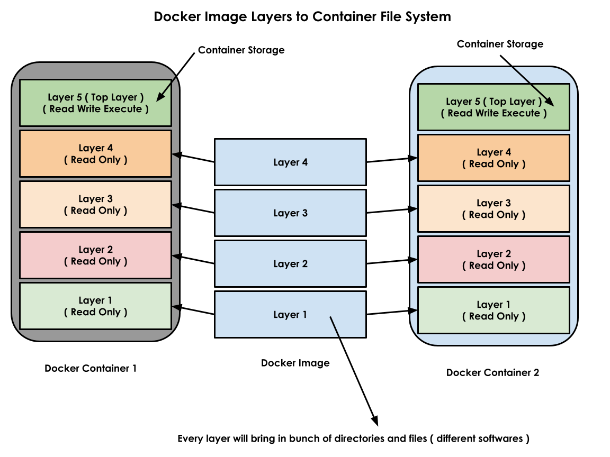
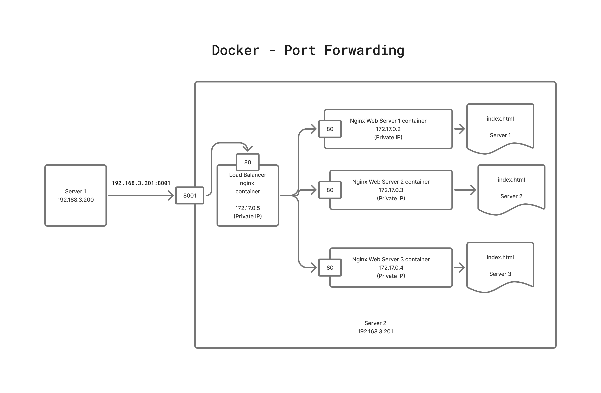

# Day 1

## Info - Hypervisor Overview
<pre>
- nothing but virtualization 
- with virtualization/hypervisor software, we can run multiple OS side by side on the same laptop/desktop/workstation/server
- there are 2 types of Hypervisors
  1. Type 1 
     - a.k.a Baremetal Hypervisor
     - is used in Workstation & Server
     - performance wise it offers almost near native performance ( 3% less performance as opposed to running a OS on direct H/W )
     - this can be installed directly on top of a H/W with no Operating System
     - examples
       1. VMWare vSphere(vCenter) - Paid
       2. Linux KVM ( opensource & Free )
       3. Microsoft Hyper-V
  2. Type 2
     - a.k.a Hosted Hypervisor
     - this can be installed only top of a Host Operating System ( Windows, Mac OSX, Linux, etc )
     - is used in Workstation, Desktops & Laptops
     - examples
       - Oracle VirtualBox ( Free - Windows/Linux/Mac )
       - VMWare Wokstation ( Free - after Broadcom acquired VMWare - Windows, Linux, Mac )
       - VMWare Fusion ( Mac OS-X - Need a commercial license )
       - Parallels ( Mac OS-X - Need a commercial license )
- virtualization helps organization save cost in many fold
  - with less physical servers, many virtual machines(Guest OS) can be supported
  - saves cost in terms of procuring less physical servers
  - saves cost in terms of power consumption
  - saves cost in terms of Air Condition 
  - saves cost in terms of Sound proofing
  - saves cost in terms of Real estate rental/leasing
- this type of virtualization is called heavy-weight 
  - because each VM requires dedicated Hardware resources
  - each VM runs a fully functional OS with its own dedicated OS Kernel
- each VM, represents one fully function Operating System
</pre>

## Info - Containerization
<pre>
- application virtualization technology
- it is light weight, because each container represents a single application not an Operating System
- all the containers that runs on top a OS shares the Hardware resources available on the underlying OS
- containers will never be able to replace an Operating System or Virtualization
- in fact, in real-world scenarios, virtualization and containerization are used in combination
- it is a linux technology
- linux kernel features that enables containerization
  1. Namespace
     - helps isolation of containers from each other
  2. Control Groups (CGroups )
     - it helps us apply resource quota restrictions like
       - we can restrict how much RAM, disk and cpu can be utilized by a container
- container runtime
  - is a low-level software that manages container images and containers
  - it is not user-friendly, hence end-user like us never use container runtime directly
  - examples
    - runC
    - cRun
    - CRI-O
- container engine
  - is a high-level software that manages container images and containers
  - it is very user-friendly, but they depend on container runtimes internally to manage images and containers
  - examples
    - docker
    - podman
</pre>

## Info - Hypervisor High-Level Architecture


## Info - Docker High-Level Architecture


## Info - Docker image
<pre>
- is a blueprint of a docker container
- you can imagine docker image similar to Window12.iso (OS Image) or Ubuntu24.04.iso(OS Image)
- with the help of a docker image, we can create any number of docker containers
- docker images => typically has one application and its dependencies ( libraries, dependent tools, etc., )
- docker images are conservatively built, which means it only contains bare minimum tools required to run a specific appliction
- every docker images gets a unique name and unique id ( 256-bit HASH )
</pre>


## Info - Docker Container
<pre>
- is the running instance of a Docker Image ( Container Image )
- each container gets a unique name and ID (SHA Hash)
- each container gets its own dedicated software defined network stack ( 7 OSI Layers )
- each container get its own file system ( files & folders )
- each container uses about 7 namespaces
- each container gets one or more IP addresses ( generally Private IP )
</pre>

## Info - Docker Registry
<pre>
- is a collection of multiple docker images
- there are 3 types
  1. Local Docker Registry
     - is a folder created and maintained by Docker server on the same machine where it runs
     - for example, in linux distros, local docker registry is maintained under directory /var/lib/docker
  2. Remote docker registry
     - is a web site ( hub.docker.com ) maintained by Docker Inc and opensource community
  3. Private Docker registry
     - can be setup using JFrog Artifactory or Sonatype Nexus
</pre>

## Demo - Installing Docker community edition (Docker CE)
```
# Add Docker's official GPG key:
sudo apt update
sudo apt install ca-certificates curl
sudo install -m 0755 -d /etc/apt/keyrings
sudo curl -fsSL https://download.docker.com/linux/ubuntu/gpg -o /etc/apt/keyrings/docker.asc
sudo chmod a+r /etc/apt/keyrings/docker.asc

# Add the repository to Apt sources:
sudo tee /etc/apt/sources.list.d/docker.sources <<EOF
Types: deb
URIs: https://download.docker.com/linux/ubuntu
Suites: $(. /etc/os-release && echo "${UBUNTU_CODENAME:-$VERSION_CODENAME}")
Components: stable
Architectures: $(dpkg --print-architecture)
Signed-By: /etc/apt/keyrings/docker.asc
EOF

sudo apt update
sudo apt install docker-ce docker-ce-cli containerd.io docker-buildx-plugin docker-compose-plugin -y
sudo systemctl enable docker
sudo systemctl start docker
sudo usermod -aG docker $USER
newgrp docker 
```

## Lab - Checking docker details
```
docker --version
docker info
```


## Lab - Listing docker images from your local docker registry
```
docker images
```


## Lab - Downloading docker images from docker hub to local registry
```
docker pull hello-world:latest
docker pull ubuntu:latest

docker images
```


## Lab - Deleting a docker image from your local registry
```
docker images | grep hello
docker rmi hello-world:latest
docker images | grep hello
```


## Lab - Creating a container in the interactive(foreground) mode
From terminal 1
```
docker run -it --name ubuntu1-jegan --hostname ubuntu1-jegan ubuntu:latest /bin/bash
hostname
hostname -i
ls
exit
```

List all running containers from second terminal
```
docker ps | grep jegan
```

List all running containers you created
```
docker ps -a | grep jegan
```


## Lab - Create a custom docker image

In your home directory, create a folder something like custom-docker-image
```
cd ~/
mkdir -p custom-docker-image
cd custom-docker-image
touch Dockerfile
```

Add the below content to your Dockerfile, you can run gedit to open windows notepad like editor
<pre>
FROM ubuntu:26.04

RUN apt update && apt install -y net-tools iputils-ping
RUN apt update && apt install -y default-jdk maven  
</pre>

Build your custom docker image
```
cd ~/custom-docker-image
docker build -t ubuntu-jegan:1.0 .
docker images | grep jegan
```

Create a container using your custom docker image
```
docker run -dit --name c1-jegan --hostname c1-jegan ubuntu-jegan:1.0 /bin/bash
docker exec -it c1-jegan /bin/bash
hostname
hostname -i
ping 8.8.8.8
ifconfig
ls
exit
```

List and see the container should still run because we created this container in background
```
docker ps
```

## Lab - Stopping a running container
```
docker ps | grep c1-jegan
docker stop c1-jegan
docker ps | grep c1-jegan
docker ps -a | grep c1-jegan
```

## Lab - Start an exited container
```
docker ps -a | grep c1-jegan
docker start c1-jegan
docker ps | grep c1-jegan
```

## Lab - Restart a running container
```
docker ps a | grep c1-jegan
docker restart c1-jegan
docker ps | grep c1-jegan
```

## Lab - Deleting a running container
In order to delete a running container gracefully, you must stop it first
```
docker stop c1-jegan
docker rm c1-jegan
docker ps -a
```

In order to delete a running container forcibly
```
docker rm -f c1-jegan
docker ps -a
```

## Lab - Rename a container
```
docker run -dit ubuntu:latest /bin/bash
docker ps a
docker rename zealous_montalcini c2-jegan
docker ps
```


## Lab - Finding details about a container image
```
docker image inspect ubuntu:26.04
```


## Lab - Finding details about a container
```
docker container inspect c1-jegan
docker inspect c1-jegan
```


## Lab - Finding IP address of a container
```
docker inspect c1-jegan | grep IPA
docker inspect -f {{.NetworkSettings.IPAddress}} c1-jegan
docker exec -it c1-jegan hostname -i
```


## Lab - Setup a Load balancer using containers


Let's create 3 web server containers using ngnix:latest image from Docker Hub website
```
docker run -d --name nginx1-jegan --hostname nginx1-jegan nginx:latest
docker run -d --name nginx2-jegan --hostname nginx2-jegan nginx:latest
docker run -d --name nginx3-jegan --hostname nginx3-jegan nginx:latest
```

List all running containers
```
docker ps
```

Find the IP addresses of the 3 webserver containers
```
docker inspect nginx1-jegan | grep IPA
docker inspect nginx2-jegan | grep IPA
docker inspect nginx3-jegan | grep IPA
```

See if you are able to access the web pages from those web server containers
```
curl http://172.17.0.2:80
curl http://172.17.0.3:80
curl http://172.17.0.4:80
```


Now, let's create the load balancer container with port-forward( to make it accessible outside the system where the lb container is running)
```
docker run -d --name lb-jegan --hostname lb-jegan -p 8080:80 nginx:latest
```
In case you wish docker to identify an available port on your lab machine and forward to that port
```
docker rm -f lb-jegan
docker run -d --name lb-jegan --hostname lb-jegan -P  nginx:latest
```


We need to copy the nginx.conf file from the lb-jegan container to configure it work like a load balancer
```
docker cp lb-jegan:/etc/nginx/nginx.conf .
cat nginx.conf
```


You need find the IP addresses of your nginx web server containers and update the nginx.conf file as shown below


You need to update the nginx.conf file with your web server IPs
```
user  nginx;
worker_processes  auto;

error_log  /var/log/nginx/error.log notice;
pid        /run/nginx.pid;

events {
    worker_connections  1024;
}

http {
    upstream myapp1 {
        server 172.17.0.2:80;
        server 172.17.0.3:80;
        server 172.17.0.4:80;
    }

    server {
        listen 80;

        location / {
            proxy_pass http://myapp1;
        }
    }
}

```

We need to copy this updated nginx.conf file from our local machine to the lb-jegan container
```
docker cp nginx.conf lb-jegan:/etc/nginx/nginx.conf
```

We need to restart the lb-jegan container to apply the config changes
```
docker restart lb-jegan
```


Make sure the lb-jegan container is running after our config changes
```
docker ps
```

Let's customize the web page in nginx1-jegan, nginx2-jegan and nginx3-jegan web server containers
```
echo "<h1>Web Server 1</h1>" > index.html
docker cp index.html nginx1-jegan:/usr/share/nginx/html/index.html

echo "<h1>Web Server 2</h1>" > index.html
docker cp index.html nginx2-jegan:/usr/share/nginx/html/index.html

echo "<h1>Web Server 3</h1>" > index.html
docker cp index.html nginx3-jegan:/usr/share/nginx/html/index.html

curl http://172.17.0.2:80
curl http://172.17.0.3:80
curl http://172.17.0.4:80
```


Let's verify if the lb-jegan container is working as configured( as a load balancer ) from firefox web browser on your lab machine
```
http://localhost:8080
http://localhost:8080
http://localhost:8080
```


Checking the load balancer logs
```
docker logs lb-jegan
```


Checking the webserver logs
```
docker logs nginx1-jegan
docker logs nginx2-jegan
docker logs nginx3-jegan
```


## Lab - Create a mysql db container
```
docker run -d --name mysql-jegan --hostname mysql-jegan -e MYSQL_ROOT_PASSWORD=root@123 mysql:latest
docker ps
docker logs mysql-jegan
```


Let's get inside the mysql db server container
```
docker exec -it mysql-jegan /bin/sh
mysql -u root -p
SHOW DATABASES;
CREATE DATABASE tektutor;
USE tektutor;
CREATE TABLE trainings ( id INT NOT NULL, name VARCHAR(200) NOT NULL, duration VARCHAR(200) NOT NULL, PRIMARY KEY(id) );
INSERT INTO trainings VALUES ( 1, "DevOps", "5 Days" );
INSERT INTO trainings VALUES ( 2, "Microservices with Golang", "5 Days" );
SELECT * FROM trainings;
exit
exit
docker ps
```


Let's try to restart the mysql container
```
docker restart mysql-jegan
docker ps
docker exec -it mysql-jegan /bin/sh
mysql -u root
SHOW DATABASES;
USE tektutor;
SHOW TABLES;
SELECT * FROM trainings;
exit
exit
```


Let's delete the mysql container. At this point, we not only lost the container, we also lost the data stored inside the container.
```
docker rm -f mysql-jegan
```

Hence, we must always store application data in an external storage.

```
mkidr -p /tmp/jegan/mysql
docker run -d --name mysql-jegan --hostname mysql-jegan -e MYSQL_ROOT_PASSWORD=root@123 -v /tmp/jegan/mysql:/var/lib/mysql mysql:latest
docker exec -it mysql-jegan /bin/sh
mysql -u root -p
SHOW DATABASES;
CREATE DATABASE tektutor;
USE tektutor;
CREATE TABLE trainings ( id INT NOT NULL, name VARCHAR(200) NOT NULL, duration VARCHAR(200) NOT NULL, PRIMARY KEY(id) );
INSERT INTO trainings VALUES ( 1, "DevOps", "5 Days" );
INSERT INTO trainings VALUES ( 2, "Microservices with Golang", "5 Days" );
SELECT * FROM trainings;
exit
exit
docker ps
```

Let's delete the mysql-jegan container and recreate a new one
```
docker rm mysql-jegan
docker run -d --name mysql-jegan --hostname mysql-jegan -e MYSQL_ROOT_PASSWORD=root@123 -v /tmp/jegan/mysql:/var/lib/mysql mysql:latest
docker exec -it mysql-jegan /bin/sh
mysql -u root -p
SHOW DATABASES;
USE tektutor;
SHOW TABLES;
SELECT * FROM trainings;
exit
exit
```

Though we delete the container and recreated a new one, we didn't lose the data because we stored the database in an external disk.
This is how, containers are used in real-world applications.
